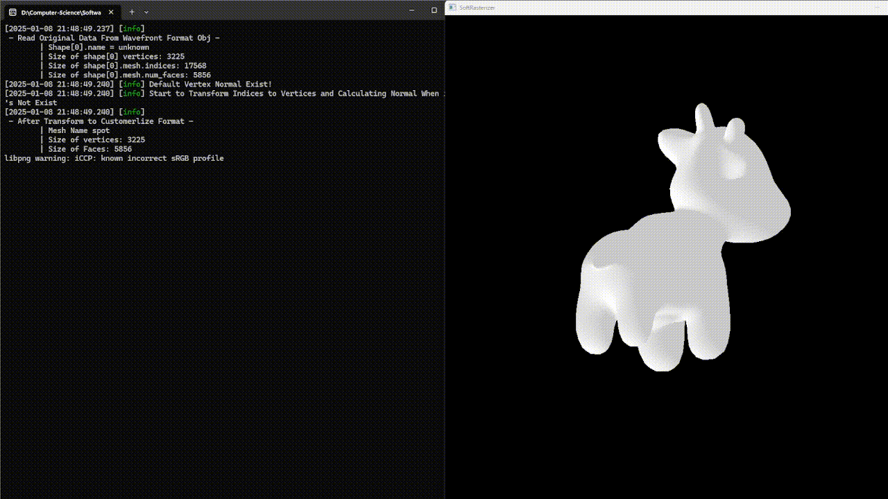

# Software-Rasterizer(SIMD Supported)
## 0x00 Description

**SoftRasterizer** is a high-performance, CPU-based 3D rendering pipeline designed for rasterizing triangles using SIMD optimizations (AVX2, SSE). This project focuses on rendering 3D models with advanced techniques such as barycentric interpolation and z-buffering. The pipeline applies shaders to objects, calculates lighting, and computes fragment values, all while optimizing performance using vectorized instructions.

### Features

- **Triangle Rasterization**: Efficiently rasterizes triangles with z-buffering and fragment shading.
- **SIMD Optimizations**: Utilizes AVX2/SSE instructions to speed up calculations.
- **Z-Buffering**: Ensures proper depth handling to produce accurate 3D renderings.
- **Lighting**: Implements basic lighting techniques using point lights.
- **Shader Integration**: Applies fragment shaders for realistic color computations.

### Optimizations

- **SIMD Vectorization**: The code utilizes AVX2 and SSE instructions to parallelize operations, significantly speeding up rasterization.
- **Prefetching**: Data prefetching is used to optimize memory access patterns, reducing cache misses and improving performance.
- **OpenMP Parallelization**: The outer loops are parallelized using OpenMP to take advantage of multi-core CPUs.


## 0x01 Example

### Set Software Resolution

```C++
SoftRasterizer::RenderingPipeline render(800, 600);
```


### Setup Vertices/Colour/Faces Manually**(deprecated)**

~~Only For Testing, We are not going to use this anymore!~~

```c++
  SoftRasterizer::RenderingPipeline render(1000, 1000);

  /*set up all vertices*/
  std::vector<Eigen::Vector3f> pos{
      {0.f, 0.5f, 0.f}, {-0.5f, -0.5f, 0.f}, {0.5f, -0.5f, 0.f}};

  /*set up all shading param(colours)*/
  std::vector<Eigen::Vector3f> color{
      {1.0f, 0.f, 0.f}, {0.f, 1.0f, 0.f}, {0.f, 0.f, 1.0f}};

  /*set up all indices(faces)*/
  std::vector<Eigen::Vector3i> ind{{0, 1, 2}};
  render.loadVertices(pos);
  render.loadColours(color);
  render.loadIndices(ind);
```


#### Draw LINES

```c++
render.display(SoftRasterizer::Primitive::LINES);
```


#### Draw Triangles

```c++
render.display(SoftRasterizer::Primitive::TRIANGLES);
```


#### Z-buffer Support

Construct two triangles with overlapping relationships and set their Z-buffer values.

```c++
std::vector<Eigen::Vector3f> pos{
    {0.f, 0.5f, -0.1f}, {-0.5f, -0.5f, -0.1f}, {0.5f, -0.5f, -0.1f},
    {0.f, 0.5f, 0.1f}, {0.7f, 0.5f, 0.1f}, {0.7f, -0.3f, 0.1f}
};

/*set up all shading param(colours)*/
std::vector<Eigen::Vector3f> color{
    {1.0f, 0.f, 0.f}, {0.f, 1.0f, 0.f}, {0.f, 0.f, 1.0f},
    {1.0f, 1.f, 1.f}, {1.f, 1.0f, 1.f}, {1.f, 1.f, 1.0f}
};

/*set up all indices(faces)*/
std::vector<Eigen::Vector3i> ind{ {0, 1, 2},{3, 4, 1} };
```


### Load Vertices/Colour/Faces From Wavefront .obj File**(Software-Rasterizer's API)**

Using Software-Rasterizer's Private API to Load Obj files

```c++
render.addGraphicObj(CONFIG_HOME"examples/models/bunny/bunny.obj", "bunny",
            Eigen::Vector3f(0.f, 1.f, 0.f), 90.f,
            Eigen::Vector3f(0.f, -0.2f, 0.5f),
            Eigen::Vector3f(2.0f, 2.0f, 2.0f)
);

render.addGraphicObj(CONFIG_HOME"examples/models/spot/spot_triangulated_good.obj", "spot",
            Eigen::Vector3f(0.f, 1.f, 0.f), 45.f,
            Eigen::Vector3f(0.f, 0.0f, 0.0f),
            Eigen::Vector3f(0.3f, 0.3f, 0.3f)
);
render.startLoadingMesh("bunny");
render.startLoadingMesh("spot");
```


#### Rotations

1. `A/a `On Keyboard: counterclockwise on Y axis
2. `D/d` On Keyboard: clockwise on Y axis


#### Draw LINES


#### Draw TRIANGLES

1. Using **Normal Shading Method** to Draw Triangles

   ```c++
   render.addGraphicObj(
     CONFIG_HOME "examples/models/spot/spot_triangulated_good.obj", "spot",
     Eigen::Vector3f(0.f, 1.f, 0.f), degree, Eigen::Vector3f(0.f, 0.0f, 0.0f),
     Eigen::Vector3f(0.3f, 0.3f, 0.3f));
   
   render.addShader("shader",
                  CONFIG_HOME "examples/models/spot/spot_texture.png",
                  SoftRasterizer::SHADERS_TYPE::NORMAL);
   
   /*This Step Has To be done Before Shader Bingding!!!*/
   render.startLoadingMesh("spot");
   render.bindShader2Mesh("spot", "shader");
   ```

   

   

2. Using **Phong Shading Method** to Draw Triangles

   ```c++
   render.addGraphicObj(
     CONFIG_HOME "examples/models/spot/spot_triangulated_good.obj", "spot",
     Eigen::Vector3f(0.f, 1.f, 0.f), degree, Eigen::Vector3f(0.f, 0.0f, 0.0f),
     Eigen::Vector3f(0.3f, 0.3f, 0.3f));
   
   render.addShader("shader",
                  CONFIG_HOME "examples/models/spot/spot_texture.png",
                  SoftRasterizer::SHADERS_TYPE::PHONG);
   
   /*This Step Has To be done Before Shader Bingding!!!*/
   render.startLoadingMesh("spot");
   render.bindShader2Mesh("spot", "shader");
   ```

   

   

3. Using **Texture Shading Method** to Draw Triangles

   ```c++
   render.addGraphicObj(
     CONFIG_HOME "examples/models/spot/spot_triangulated_good.obj", "spot",
     Eigen::Vector3f(0.f, 1.f, 0.f), degree, Eigen::Vector3f(0.f, 0.0f, 0.0f),
     Eigen::Vector3f(0.3f, 0.3f, 0.3f));
   
   render.addShader("shader",
                  CONFIG_HOME "examples/models/spot/spot_texture.png",
                  SoftRasterizer::SHADERS_TYPE::TEXTURE);
   
   /*This Step Has To be done Before Shader Bingding!!!*/
   render.startLoadingMesh("spot");
   render.bindShader2Mesh("spot", "shader");
   ```

   

   

## 0x02 Developer Quick Start

### Platform Support
Windows, Linux, MacOS(Intel and M Serious Chip)


### Requirements

- C++17 or later

- SIMD support (AVX2, SSE)

- OpenMP support for parallelization

  ```bash
  sudo apt-get install libomp-dev
  ```

  

- OpenCV

  You have to set OpenCV_DIR by system path variable or cmake variable before building Software-Rasterizer

  ```cmake
  set(OpenCV_DIR "path/to/opencv")
  ```

  

### Building the Project

To build the project, follow these steps:

1. Clone the repository:

   ```bash
   git clone https://github.com/Liupeter01/Software-Rasterizer
   cd Software-Rasterizer
   git submodule update --init
   cmake -B build -DCMAKE_BUILD_TYPE=Release
   cmake --build build --parallel x
   ```

2. Download dependencies

   ```bash
   git submodule update --init
   ```

3. Compile(Better Enable O3 on Linux/MacOS)

   ```bash
   cmake -B build -DCMAKE_BUILD_TYPE=Release [-DCMAKE_CXX_FLAGS]=-O3
   cmake --build build --parallel x
   ```

   

## 0x03 License

This project is licensed under the MIT License.


## 0x04 Reference

### Bresenham algorithm

[drawing-lines-with-bresenhams-line-algorithm](https://stackoverflow.com/questions/10060046/drawing-lines-with-bresenhams-line-algorithm)

### TinyObjLoader

[tinyobjloader](https://github.com/tinyobjloader/tinyobjloader)

### SSE2NEON

[sse2neon](https://github.com/DLTcollab/sse2neon)

### simde

[simde](https://github.com/simd-everywhere/simde)
