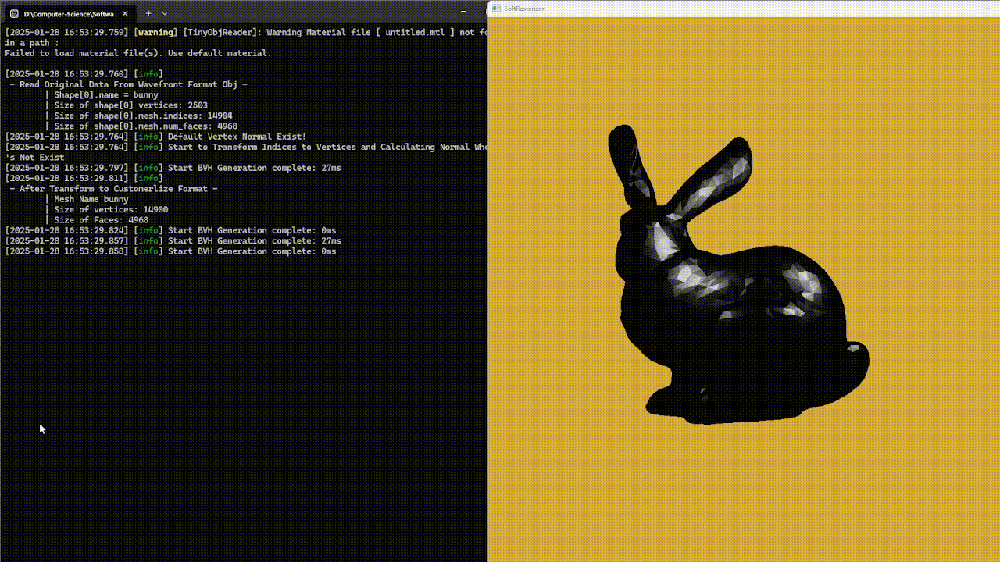
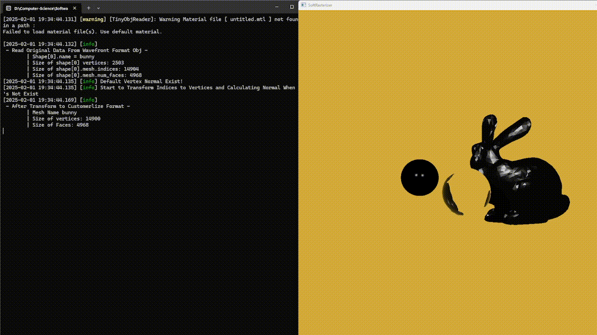
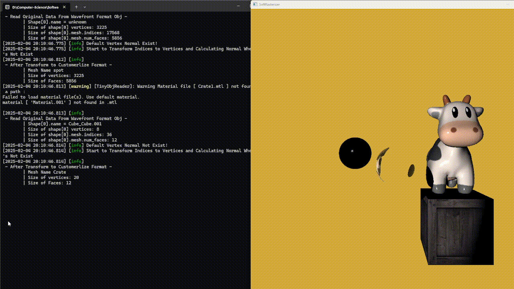

# Software-Rasterizer
## 0x00 Description

**SoftRasterizer** is a high-performance, CPU-based 3D rendering pipeline designed for rasterizing triangles using SIMD optimizations (AVX2, SSE) and ray-tracing and path-tracing systems. This project focuses on rendering 3D models with advanced techniques such as barycentric interpolation and z-buffering. The pipeline applies shaders to objects, calculates lighting, and computes fragment values, all while optimizing performance using vectorized instructions.

### Features

- **Traditional Triangle Rasterization(SIMD Supported)**: Efficiently rasterizes triangles with z-buffering and fragment shading.
- **Ray Tracing**: Emit ray from camera to every pixel on the screen.
- **SIMD Optimizations**: Utilizes AVX2/SSE instructions to speed up calculations.
- **Z-Buffering**: Ensures proper depth handling to produce accurate 3D renderings.
- **Lighting**: Implements basic lighting techniques using point lights.
- **Shader Integration**: Applies fragment shaders for realistic color computations.
- **Multi-threading Support**: Leverages parallel processing for improved performance.
- **Materials**: Implements Lambertian, specular, and bump surfaces.
- **BVH Acceleration**: Uses Bounding Volume Hierarchy for efficient ray-object intersection.
- **Physically Based Rendering (PBR)**: Utilizes Monte Carlo integration for realistic light transport.
- **Path Tracing(Offline)**: PathTracer is a physically-based path tracing renderer designed for realistic image synthesis. This project implements global illumination using Monte Carlo integration, supporting various material types, light transport methods, and optimizations to enhance rendering performance.

### Optimizations

- **SIMD Vectorization**: The code utilizes AVX2 and SSE instructions to parallelize operations, significantly speeding up rasterization.

- **Prefetching**: Data prefetching is used to optimize memory access patterns, reducing cache misses and improving performance.

- **OpenMP Parallelization**: The outer loops are parallelized using OpenMP to take advantage of multi-core CPUs.

- **TBB Parallel**: TBB library

  

## 0x01 Developer Quick Start

### Platform Support

Windows, Linux, MacOS(Intel and M Serious Chip)

### Requirements

- **C++17 or later**

- **SIMD support (AVX2, SSE)**

- **CMake 3.15+**

- **TBB**

- **sse2neon**

- **tinyobjloader**

- **simde**

- **GLM** (for vector and matrix operations)

- **OpenMP**

  ```bash
  sudo apt-get install libomp-dev
  ```

- **OpenCV** 

  You have to set OpenCV_DIR by system path variable or cmake variable before building Software-Rasterizer

  ```cmake
  set(OpenCV_DIR "path/to/opencv")
  ```


### Building the Project

To build the project, follow these steps:

1. Clone the repository:

   ```bash
   git clone https://github.com/Liupeter01/Software-Rasterizer
   cd Software-Rasterizer
   git submodule update --init
   cmake -B build -DCMAKE_BUILD_TYPE=Release
   cmake --build build --parallel x
   ```

2. Download dependencies

   ```bash
   git submodule update --init
   ```

3. Compile(Better Enable O3 on Linux/MacOS)

   ```bash
   cmake -B build -DCMAKE_BUILD_TYPE=Release [-DCMAKE_CXX_FLAGS]=-O3
   cmake --build build --parallel x
   ```

   

## 0x02 Traditional Triangle Rasterization

### Setup Objects By  Raw Coordinates**(deprecated)** 

```c++
  SoftRasterizer::RenderingPipeline render(1000, 1000);
  /*set up all vertices*/
  std::vector<Eigen::Vector3f> pos{{0.f, 0.5f, 0.f}, {-0.5f, -0.5f, 0.f}, {0.5f, -0.5f, 0.f}};
  /*set up all shading param(colours)*/
  std::vector<Eigen::Vector3f> color{{1.0f, 0.f, 0.f}, {0.f, 1.0f, 0.f}, {0.f, 0.f, 1.0f}};
  /*set up all indices(faces)*/
  std::vector<Eigen::Vector3i> ind{{0, 1, 2}};
```

#### Draw Lines


#### Draw Triangles

Construct two triangles with overlapping relationships and set their Z-buffer values.


### Setup Objects By Software-Rasterizer's API

#### Add Tradition Rasterizer  to setup resolution of screen(Software-Rasterizer's API)

```c++
#include <render/Rasterizer.hpp>
  auto render = std::make_shared<SoftRasterizer::TraditionalRasterizer>(1024, 1024); // Create Render Main Class
```

####  Add Scene(Software-Rasterizer's API)

Every Scene could contains multiple objects, and all object should be added by using the method inside scene

```c++
#include <scene/Scene.hpp>
auto scene = std::make_shared<SoftRasterizer::Scene>(
  "TestScene",
  /*eye=*/glm::vec3(0.0f, 0.0f, 0.9f),
  /*center=*/glm::vec3(0.0f, 0.0f, 0.0f),
  /*up=*/glm::vec3(0.0f, 1.0f, 0.0f)); // Create A Scene
```

1. Load obj From Wavefront .obj File**(Software-Rasterizer's API)**

   ```c++
     scene->addGraphicObj(CONFIG_HOME
                          "examples/models/spot/spot_triangulated_good.obj",
                          "spot", glm::vec3(0, 1, 0), degree,
                          glm::vec3(0.f, 0.0f, 0.0f), glm::vec3(0.3f, 0.3f, 0.3f));
   ```

2. Add Shader(using a texture)

   ```c++
     scene->addShader("spot_shader",
                      CONFIG_HOME "examples/models/spot/spot_texture.png",
                      SoftRasterizer::SHADERS_TYPE::TEXTURE);
   ```

3. Loading Mesh When ready

   ```c++
     scene->startLoadingMesh("spot");
   ```

4. Bind a shader to a specific mesh

   ```c++
   scene->bindShader2Mesh("spot", "spot_shader");
   ```

5. Add Lights to the illuminate the scene

   At here, we are going to create two lights

   ```c++
   struct light_struct {
       glm::vec3 position;
       glm::vec3 intensity;
   };
   
   auto light1 = std::make_shared<SoftRasterizer::light_struct>();
   light1->position = glm::vec3{0.9, 0.9, -0.9f};
   light1->intensity = glm::vec3{100, 100, 100};
   
   auto light2 = std::make_shared<SoftRasterizer::light_struct>();
   light2->position = glm::vec3{0.f, 0.8f, 0.9f};
   light2->intensity = glm::vec3{50, 50, 50};
   
     scene->addLight("Light1", light1);
     scene->addLight("Light2", light2);
   ```

6. Finally, Add Scene to the render

   ```c++
     /*Register Scene To Render Main Frame*/
     render->addScene(scene);
   ```

   

#### Draw TRIANGLES

1. Using **Normal Shading Method** to Draw Triangles

   ```c++
     scene->addShader("spot_shader",
                      CONFIG_HOME "examples/models/spot/spot_texture.png",
                      SoftRasterizer::SHADERS_TYPE::NORMAL);
   ```

   

   

2. Using **Phong Shading Method** to Draw Triangles

   ```c++
     scene->addShader("spot_shader",
                      CONFIG_HOME "examples/models/spot/spot_texture.png",
                      SoftRasterizer::SHADERS_TYPE::PHONG);
   ```

   

   

3. Using **Texture Shading Method** to Draw Triangles

   ```c++
     scene->addGraphicObj(CONFIG_HOME
                          "examples/models/spot/spot_triangulated_good.obj",
                          "spot", glm::vec3(0, 1, 0), degree,
                          glm::vec3(0.f, 0.0f, 0.0f), glm::vec3(0.3f, 0.3f, 0.3f));
   
     scene->addGraphicObj(CONFIG_HOME "examples/models/Crate/Crate1.obj", "Crate",
                          glm::vec3(0.f, 1.f, 0.f), degree,
                          glm::vec3(0.0f, 0.0f, 0.0f),
                          glm::vec3(0.2f, 0.2f, 0.2f));
   
     scene->addShader("spot_shader",
                      CONFIG_HOME "examples/models/spot/spot_texture.png",
                      SoftRasterizer::SHADERS_TYPE::TEXTURE);
   
     scene->addShader("crate_shader",
                      CONFIG_HOME "examples/models/Crate/crate1.png",
                      SoftRasterizer::SHADERS_TYPE::TEXTURE);
   
     scene->startLoadingMesh("spot");
     scene->startLoadingMesh("Crate");
     scene->bindShader2Mesh("spot", "spot_shader");
     scene->bindShader2Mesh("Crate", "crate_shader");
   ```

   

   

## 0x03 Ray Tracing

### Setup Ray Tracing Objects By Using  Software-Rasterizer's API

#### Add Ray Tracing  to setup resolution of screen(Software-Rasterizer's API)

```c++
#include <render/RayTracing.hpp>
auto render = std::make_shared<SoftRasterizer::RayTracing>(1024, 1024); 	  // Create Ray Tracing Main Class
```

####  Add Scene(Software-Rasterizer's API)

Every Scene could contains multiple objects, and all object should be added by using the method inside scene object

```c++
#include <scene/Scene.hpp>
auto scene = std::make_shared<SoftRasterizer::Scene>(
    "TestScene",
    /*eye=*/glm::vec3(0.0f, 0.0f, 0.9f),
    /*center=*/glm::vec3(0.0f, 0.0f, 0.0f),
    /*up=*/glm::vec3(0.0f, 1.0f, 0.0f),
    /*background color*/ glm::vec3(0.235294, 0.67451, 0.843137)); 
```

#### Setup Objects

1. Load a Diffuse Sphere

   ```c++
     /*Set Diffuse Color*/
     auto diffuse_sphere = std::make_unique<SoftRasterizer::Sphere>(
         /*center=*/glm::vec3(-0.07f, 0.0f, 0.f),
         /*radius=*/0.1f);
   
     diffuse_sphere->getMaterial()->type =
         SoftRasterizer::MaterialType::DIFFUSE_AND_GLOSSY;
     diffuse_sphere->getMaterial()->color = glm::vec3(0.6f, 0.7f, 0.8f);
     diffuse_sphere->getMaterial()->Kd = glm::vec3(0.6f, 0.7f, 0.8f);
     diffuse_sphere->getMaterial()->Ka = glm::vec3(0.105f);
     diffuse_sphere->getMaterial()->Ks = glm::vec3(0.7937f);
     diffuse_sphere->getMaterial()->specularExponent = 150.f;
   ```

2. Load a reflection and refraction glass sphere`(ior = 1.49f)`

   ```c++
     /*Set reflection and refraction Sphere Object*/
     auto reflect_sphere = std::make_unique<SoftRasterizer::Sphere>(
         /*center=*/glm::vec3(-0.05f, 0.01f, 0.f),
         /*radius=*/0.1f);
   
     /*Set REFLECTION_AND_REFRACTION Material*/
     reflect_sphere->getMaterial()->type =
         SoftRasterizer::MaterialType::REFLECTION_AND_REFRACTION;
     reflect_sphere->getMaterial()->ior = 1.49f; /*Air to Glass*/
   ```

3. Load obj From Wavefront .obj File**(Software-Rasterizer's API)**

   ```c++
   scene->addGraphicObj(CONFIG_HOME "examples/models/bunny/bunny.obj", "bunny",
           glm::vec3(0, 1, 0), 0.f, glm::vec3(0.f), glm::vec3(1.f));
   ```

4. Loading Mesh When ready

   ```c++
   scene->startLoadingMesh("bunny");
   ```

5. Bind a shader to a specific mesh (And / Or Setup Material Properties Manually)

   ```c++
   auto bunny_obj = scene->getMeshObj("bunny");
     bunny_obj.value()->getMaterial()->type = SoftRasterizer::MaterialType::DIFFUSE_AND_GLOSSY;
     bunny_obj.value()->getMaterial()->color = glm::vec3(1.0f);
     bunny_obj.value()->getMaterial()->Kd = glm::vec3(1.0f);
     bunny_obj.value()->getMaterial()->Ka = glm::vec3(0.015f);
     bunny_obj.value()->getMaterial()->Ks = glm::vec3(0.7937f);
     bunny_obj.value()->getMaterial()->specularExponent = 150.f;
   ```

6. Add Lights to the illuminate the scene

   At here, we are going to create two lights

   ```c++
   /*Add Light To Scene*/
   auto light1 = std::make_shared<SoftRasterizer::light_struct>();
   light1->position = glm::vec3{0.5f, -0.4f, -0.9f};
   light1->intensity = glm::vec3{1, 1, 1};
   
   auto light2 = std::make_shared<SoftRasterizer::light_struct>();
   light2->position = glm::vec3{ -0.5f, -0.4f, -0.9f };
   light2->intensity = glm::vec3{ 1, 1, 1 };
   
   scene->addLight("Light1", light1);
   scene->addLight("Light2", light2);
   ```

7. Finally, Add Scene to the render

   ```c++
   /*Register Scene To Render Main Frame*/
   render->addScene(scene);
   ```








## 0x04 Path Tracing(Offline Rendering ~~bug still remaining~~)

Implements a simple physically-based path tracing renderer using Monte Carlo integration. The renderer simulates realistic global illumination by computing direct and indirect lighting through recursive ray bouncing.

### Technical Details

#### Rendering Equation

The path tracer solves the rendering equation:

$$
L_o(p, \omega_o) = L_e(p, \omega_r) 
                  + \int_{Ω+} F_r(p, \omega_i, \omega_o) \ L_i(p, \omega_i) \ (\vec{n} \ \vec{\omega_i}) \ d\omega_i
$$

#### Monte Carlo Estimation of Outgoing Radiance

$$
L_o(p, \omega_o) =  \int_{Ω+} F_r(p, \omega_i, \omega_o) \ L_i(p, \omega_i) \ (\vec{n} \ \vec{\omega_i}) \ d\omega_i \\
≈  \frac{1}{N}\sum_{i=1}^N\frac{f(x)}{p(\omega_i)} = \frac{1}{N}\sum_{i=1}^N\frac{F_r(p, \omega_i, \omega_o) \ L_i(p, \omega_i) \ (\vec{n} \ \vec{\omega_i})}{p(\omega_i)}
$$

#### Direct Lighting Calculation

- Samples a light source and computes its contribution using **geometric and BRDF evaluations**.

- Ensures **visibility checks** through shadow ray intersection testing.

- Uses the **faceforward** function to correctly orient normals.

- Computes **radiance contribution** as:
  $$
  L = \frac{L_i.F_r.cos(\theta_o).cos(\theta_l)}{PDF.d^2}
  $$
  

#### Indirect Lighting Calculation

- Uses **Russian Roulette termination** to limit recursion depth.

- Samples a **new direction (wo) based on the BRDF distribution**.

- Computes **importance sampling probability (PDF)** for the new direction.

- Prevents **simultaneous reflection and refraction**.

- Recursively traces new rays, accumulating indirect radiance as:
  $$
  L_{indirect} = \frac{F_r.cos(\theta_o).L_{o}}{PDF.p}
  $$
  

#### **Path Tracing Pipeline**

1. **Ray Generation**: Primary rays are shot from the camera.
2. **Intersection Testing**: Finds the closest intersected object in the scene.
3. **Direct Lighting Calculation**:
   - Sample a light source.
   - Check for occlusion (shadow ray test).
   - Evaluate BRDF and compute the light contribution.
4. **Indirect Lighting Calculation**:
   - Randomly sample a new direction based on the material’s BRDF.
   - Recursively trace the new ray with Russian Roulette probability.
5. **Final Color Computation**: Combines direct and indirect contributions.


### Performance

- **1024 Samples Per Pixel (SPP)**: Renders a 1024x1024 image in approximately **10 minutes** on an i7-12800HX.
- **512 SPP**: Achieves a visually acceptable image in **5 minutes** with minimal noise.
- **64 SPP**: Provides a preview render in **under 1 minute**, useful for interactive adjustments.


### Setup Path Tracing Objects By Using Software-Rasterizer's API

#### Add Path-Tracing to setup resolution of screen(Software-Rasterizer's API)

**you may need to setup SPP(sample per pixel) argument to improve image's quality**

```c++
  auto render =
      std::make_shared<SoftRasterizer::PathTracing>(1024, 1024, /*SPP=*/16);
```

####  Add Scene(Software-Rasterizer's API)

Every Scene could contains multiple objects, and all object should be added by using the method inside scene object

```c++
  auto scene = std::make_shared<SoftRasterizer::Scene>(
      "TestScene",
      /*eye=*/glm::vec3(0.0f, 0.3f, -0.9f),
      /*center=*/glm::vec3(0.0f, 0.0f, 0.0f),
      /*up=*/glm::vec3(0.0f, 1.0f, 0.0f),
      /*background color*/ glm::vec3(0.f));
```

#### Setup Objects

1. Setup Duplicate Material Arguments

   ```c++
   std::shared_ptr<SoftRasterizer::Material> red = std::make_shared<SoftRasterizer::Material>();
   std::shared_ptr<SoftRasterizer::Material> green = std::make_shared<SoftRasterizer::Material>();
   std::shared_ptr<SoftRasterizer::Material> white = std::make_shared<SoftRasterizer::Material>();
   std::shared_ptr<SoftRasterizer::Material> light = std::make_shared<SoftRasterizer::Material>();
   red->Kd = glm::vec3(0.f, 0.f, 0.5f);
   green->Kd = glm::vec3(0.f, 0.5f, 0.f);
   white->Kd = glm::vec3(0.68f, 0.71f, 0.725f);
   light->Kd = glm::vec3(1.0f);
   light->emission = glm::vec3(31.0808f / 50.f, 38.5664f / 50.f, 47.8848f / 50.f);
   ```

2. Add Cornell Box Components

   ```c++
     float degree = 180.0f;   
   scene->addGraphicObj(CONFIG_HOME "examples/models/cornellbox/cornellbox_parts/floor.obj",
         "floor", glm::vec3(0, 1, 0), degree, glm::vec3(0.f), glm::vec3(1.f));
     scene->addGraphicObj(CONFIG_HOME "examples/models/cornellbox/cornellbox_parts/back.obj",
         "back", glm::vec3(0, 1, 0), degree, glm::vec3(0.f), glm::vec3(1.f));
     scene->addGraphicObj(CONFIG_HOME "examples/models/cornellbox/cornellbox_parts/top.obj", "top",
         glm::vec3(0, 1, 0), degree, glm::vec3(0.f), glm::vec3(1.f));
     scene->addGraphicObj( CONFIG_HOME "examples/models/cornellbox/cornellbox_parts/left.obj",
         "left", glm::vec3(0, 1, 0), degree, glm::vec3(0.f), glm::vec3(1.f));
     scene->addGraphicObj(CONFIG_HOME "examples/models/cornellbox/cornellbox_parts/right.obj",
         "right", glm::vec3(0, 1, 0), degree, glm::vec3(0.f), glm::vec3(1.f));
     scene->addGraphicObj(CONFIG_HOME "examples/models/cornellbox/cornellbox_parts/light.obj",
         "light", glm::vec3(0, 1, 0), degree, glm::vec3(0.f), glm::vec3(1.f));
     scene->addGraphicObj(CONFIG_HOME "examples/models/cornellbox/cornellbox_parts/small.obj",
         "shortbox", glm::vec3(0, 1, 0), degree, glm::vec3(0.f), glm::vec3(1.f));
     scene->addGraphicObj(CONFIG_HOME "examples/models/cornellbox/cornellbox_parts/large.obj",
         "tallbox", glm::vec3(0, 1, 0), degree, glm::vec3(0.f), glm::vec3(1.f));
   
     scene->startLoadingMesh("floor");
     scene->startLoadingMesh("back");
     scene->startLoadingMesh("top");
     scene->startLoadingMesh("left");
     scene->startLoadingMesh("right");
     scene->startLoadingMesh("light");
     scene->startLoadingMesh("shortbox");
     scene->startLoadingMesh("tallbox");
   ```

3. Bind Material To The Objects

   ```c++
     if (auto lightOpt = scene->getMeshObj("light"); lightOpt) {(*lightOpt)->setMaterial(light);}
     if (auto leftOpt = scene->getMeshObj("left"); leftOpt) { (*leftOpt)->setMaterial(green);}
     if (auto rightOpt = scene->getMeshObj("right"); rightOpt) { (*rightOpt)->setMaterial(red);}
     if (auto floorOpt = scene->getMeshObj("floor"); floorOpt) { (*floorOpt)->setMaterial(white);}
     if (auto topOpt = scene->getMeshObj("top"); topOpt) { (*topOpt)->setMaterial(white); }
     if (auto backOpt = scene->getMeshObj("back"); backOpt) { (*backOpt)->setMaterial(white); }
     if (auto shortboxOpt = scene->getMeshObj("shortbox"); shortboxOpt) { (*shortboxOpt)->setMaterial(white); }
     if (auto tallboxOpt = scene->getMeshObj("tallbox"); tallboxOpt) {(*tallboxOpt)->setMaterial(white);}
       scene->setModelMatrix("floor", glm::vec3(0, 1, 0), degree, glm::vec3(0.f),glm::vec3(0.25f));
       scene->setModelMatrix("back", glm::vec3(0, 1, 0), degree, glm::vec3(0.f),glm::vec3(0.25f));
       scene->setModelMatrix("top", glm::vec3(0, 1, 0), degree, glm::vec3(0.f),glm::vec3(0.25f));
       scene->setModelMatrix("left", glm::vec3(0, 1, 0), degree, glm::vec3(0.f),glm::vec3(0.25f));
       scene->setModelMatrix("right", glm::vec3(0, 1, 0), degree, glm::vec3(0.f),glm::vec3(0.25f));
       scene->setModelMatrix("light", glm::vec3(0, 1, 0), degree, glm::vec3(0.f),glm::vec3(0.25f));
       scene->setModelMatrix("shortbox", glm::vec3(0, 1, 0), degree,glm::vec3(0.f), glm::vec3(0.25f));
       scene->setModelMatrix("tallbox", glm::vec3(0, 1, 0), degree, glm::vec3(0.f),glm::vec3(0.25f));
   ```

4. Finally, Add Scene to the render

   ```c++
   /*Register Scene To Render Main Frame*/
   render->addScene(scene);
   ```


## 0x05 License

This project is licensed under the MIT License.


## 0x06 Reference

### Bresenham algorithm

[drawing-lines-with-bresenhams-line-algorithm](https://stackoverflow.com/questions/10060046/drawing-lines-with-bresenhams-line-algorithm)

### TinyObjLoader

[tinyobjloader](https://github.com/tinyobjloader/tinyobjloader)

### SSE2NEON

[sse2neon](https://github.com/DLTcollab/sse2neon)

### simde

[simde](https://github.com/simd-everywhere/simde)
